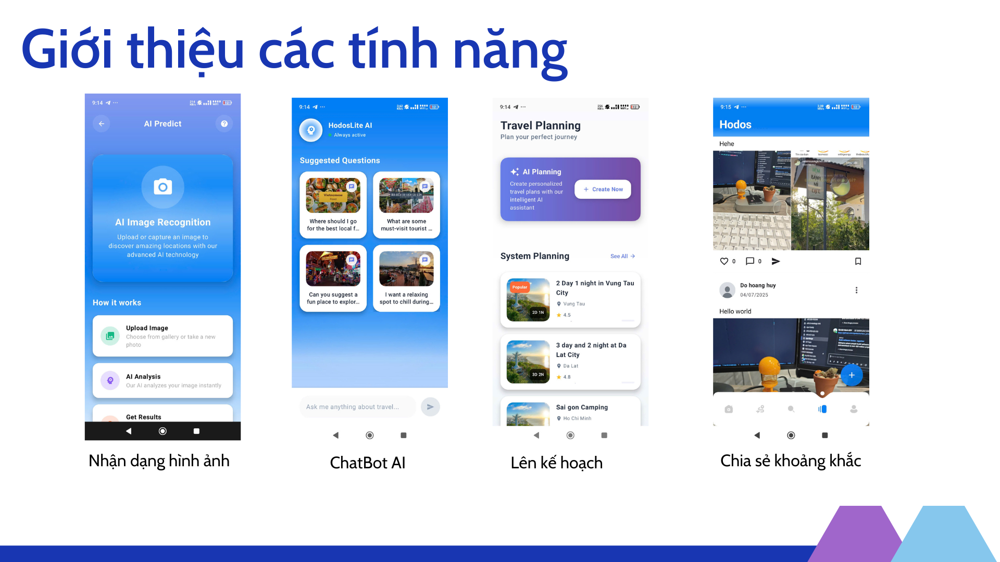

# HODOS_OFFLINE

## 1. Giới thiệu
HODOS_OFFLINE là ứng dụng Android nhận diện địa điểm và món ăn bằng AI (TensorFlow Lite), hoạt động hoàn toàn offline. Ứng dụng cung cấp giao diện hiện đại, dễ sử dụng, tích hợp AI để phân loại hình ảnh nhanh chóng.


## 1.1. Tính năng nổi bật: Nhận diện hình ảnh (AI Image Recognition)


- **Nhận diện hình ảnh bằng AI:**
  - Chụp ảnh hoặc chọn ảnh từ thư viện, ứng dụng sẽ tự động phân tích và nhận diện địa điểm/món ăn bằng công nghệ TensorFlow Lite.
  - Kết quả trả về nhanh chóng, chính xác, không cần kết nối internet.
  - Quy trình sử dụng đơn giản:
    1. Chụp ảnh hoặc chọn ảnh từ thư viện.
    2. AI tự động phân tích và nhận diện.
    3. Hiển thị thông tin chi tiết về địa điểm/món ăn.
  - **Lợi ích:** Tiện lợi khi đi du lịch, khám phá địa điểm mới, bảo mật thông tin cá nhân.

> _Ảnh minh họa: Bạn có thể thay thế đường dẫn ảnh trên bằng ảnh màn hình app phần nhận diện hình ảnh._

## 2. Kiến trúc hệ thống
- **Nền tảng:** Android (Kotlin, Android SDK)
- **Thành phần chính:**
  - `MainActivity`: Điều phối giao diện, navigation drawer, khởi tạo AIModelHelper
  - `Fragments`: Home, Gallery, Slideshow (quản lý UI từng màn hình)
  - `AIModelHelper`: Nạp và chạy mô hình AI (TensorFlow Lite), xử lý ảnh, trả về kết quả
  - `Model`: LstLocation, Location (quản lý dữ liệu)
  - `Resource`: Layout XML, themes, navigation, assets (mô hình AI, ảnh mẫu)

## 3. Luồng hoạt động
1. Người dùng mở app, giao diện chính hiển thị với navigation drawer
2. Chọn chức năng (ví dụ: nhận diện địa điểm)
3. Chụp ảnh hoặc chọn ảnh từ thư viện
4. Ảnh truyền vào `AIModelHelper`, xử lý qua mô hình TensorFlow Lite
5. Kết quả phân loại hiển thị qua BottomSheetDialog hoặc UI tương ứng
6. Xem thông tin chi tiết về địa điểm/món ăn

## 4. Hướng dẫn cài đặt
### Yêu cầu
- Android Studio (Giraffe+)
- JDK 11 trở lên
- Android SDK 24+

### Cài đặt
```bash
git clone <repo-url>
cd native-code
```
- Mở bằng Android Studio: File > Open > native-code
- Đảm bảo đã cài Android SDK 24+ và JDK 11
- Sync Gradle nếu được yêu cầu

### Build
- Build trên Android Studio: Build > Make Project hoặc Shift+F10 để chạy
- Hoặc dùng terminal:
```bash
./gradlew assembleDebug
```

### Deploy
- Kết nối thiết bị Android hoặc dùng trình giả lập
- Nhấn Run trên Android Studio hoặc:
```bash
./gradlew installDebug
```

## 5. Ghi chú
- **Mô hình AI:** Đặt file `.tflite` vào thư mục `assets` nếu muốn thay đổi mô hình
- **ProGuard:** Đã cấu hình cơ bản, cần bổ sung nếu dùng thêm thư viện
- **Thư viện:** TensorFlow Lite, Glide, Material Components, AndroidX, Gson
- **Cấu hình:** Sửa trong `app/build.gradle.kts` và `gradle.properties` nếu cần tối ưu hiệu năng hoặc thêm tính năng
- **Đóng góp:** Tạo pull request hoặc issue nếu muốn đóng góp hoặc báo lỗi

---
Nếu cần bổ sung chi tiết về kiến trúc, AI, UI, hoặc hướng dẫn sử dụng, vui lòng liên hệ hoặc tạo issue!
